# Lecture 1: Course Vision and When to Use ML

<iframe width="720" height="405" src="https://www.youtube-nocookie.com/embed/-Iob-FW5jVM" title="YouTube video player" frameborder="0" allow="accelerometer; autoplay; clipboard-write; encrypted-media; gyroscope; picture-in-picture" allowfullscreen></iframe>

## 1 - Course Vision

### History of FSDL

**Full Stack Deep Learning (FSDL) is the course and community for people
who are building products that are powered by machine learning (ML).**
It's an exciting time to talk about ML-powered products, because ML is
rapidly becoming a mainstream technology - as you can see in startup
funding, job postings, and continued investments of large companies.

FSDL was originally started in 2018, when the most exciting ML-powered
products were built by the biggest companies. However, the broader
narrative in the field was that very few companies were able to get
value out of this technology.

Now in 2022, there's a proliferation of powerful products that are
powered by ML. The narrative has shifted as well: There's
standardization that has emerged around the tech stack - with
transformers and NLP starting to seep their way into more use cases, as
well as practices around how to apply ML technologies in the world. One
of the biggest changes in the field in the past 4 years has been the
emergence of the term **MLOps**.

Why has the change been so rapid, you might ask? In addition to the
field being more mature and research continues to progress, a big reason
is that **the training of models is starting to commoditized**.

-   With tools like HuggingFace, you can deploy a state-of-the-art NLP
or CV model in one or two lines of code.

-   AutoML is starting to work for a lot of applications.

-   Companies are starting to provide models as a service, where you
don't even have to download open-source packages to use it. You
can just make a network call to get predictions from a
state-of-the-art model.

-   Many frameworks are starting to standardize around Keras and PyTorch
Lightning.

### AI Progress

The history of ML is characterized by the rise and fall of the public
perception of the technology. These were driven by a few different AI
winters that happened over the history of the field - where the
technology didn't live up to its hype. If you project forward a few
years, what will happen to ML?

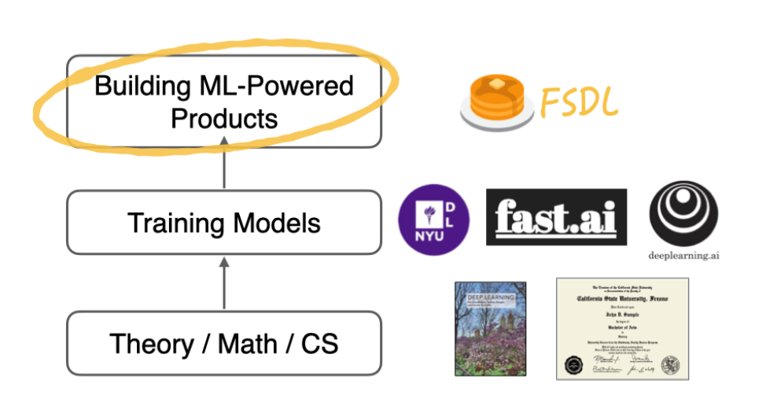

*Source: [[5 Things You Should Know About
AI]{.underline}](https://www.cambridgewireless.co.uk/lecture-1-media/uploads/resources/AI%20Group/AIMobility-11.05.17-Cambridge_Consultants-Monty_Barlow.pdf)
(Cambridge Consultants, May 2017)*

There would be a few outcomes:

1.  The prospect of a true AI winter, where people become skeptical
about AI as a technology, may be less likely.

2.  A slightly more likely outcome is that the overall luster of the
technology starts to wear off, but certain applications are
getting a ton of value out of it.

3.  The upside outcome for the field is that AI continues to accelerate
rapidly and becomes pervasive and incredibly effective.

Our conjecture is that: **The way we, as a field, avoid an AI winter is
by translating research progress into real-world products.** That's how
we avoid repeating what has happened in the past.

### ML-Powered Products Require a Different Process

Building ML-powered products requires a fundamentally different process
in many ways than developing ML models in an academic setting.

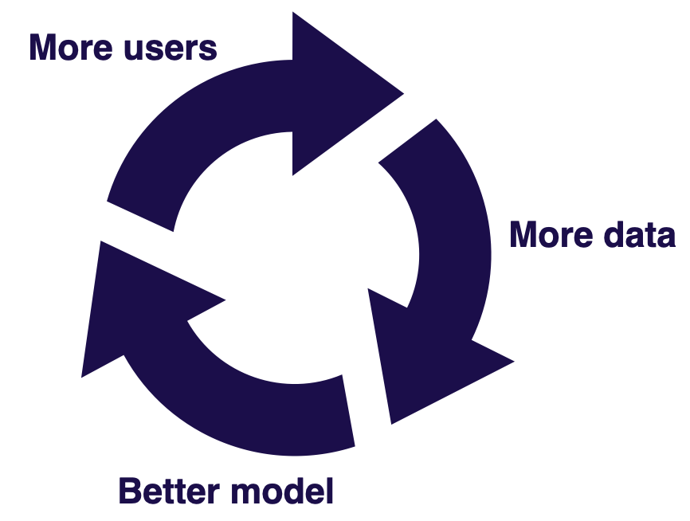

In academia, you build **"flat-earth" ML** - selecting a problem,
collecting data, cleaning and labeling the data, iterating on model
development until you have a model that performs well on the dataset
collected, evaluating that model, and writing a report at the end.

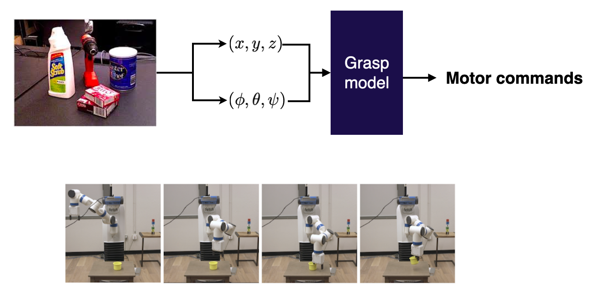

But ML-powered products require **an outer loop** where after you deploy
the model into production, you measure how that model performs when it
interacts with real users. Then, you use real-world data to build a data
flywheel and continue this as part of an outer loop.

### This Course

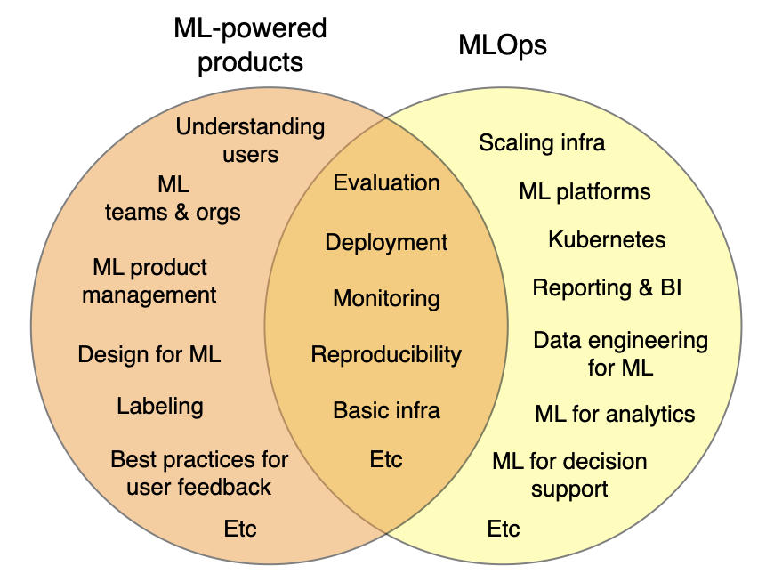

This class is about the unique aspects that you need to know beyond
training models to build great ML-powered products. Here are some
concrete goals for us:

1.  Teaching you generalist skills and an understanding of the
components of ML-powered products (and ML projects more
generally).

2.  Teaching you enough MLOps to get things done.

3.  Sharing best practices and explaining the motivation behind them.

4.  Learning things that might help you with ML engineer job interviews.

5.  Forming a community to learn together and from each other.

We do NOT try to:

1.  Teach you ML or software engineering from scratch.

2.  Cover the whole breadth of deep learning techniques.

3.  Make you an expert in any single aspect of ML.

4.  Do research in deep learning.

5.  Cover the full spectrum of MLOps.

If you feel rusty on your pre-requisites but want to get started with
FDSL, here are our recommendations to get up to speed with the
fundamentals:

-   Andrew Ng's [[Machine Learning Coursera
course]{.underline}](https://www.coursera.org/collections/machine-learning)

-   Google's [[crash course on Machine
Learning]{.underline}](https://developers.google.com/machine-learning/crash-course)

-   MIT's [[The Missing
Semester]{.underline}](https://missing.csail.mit.edu/) on software
engineering

### ML-Powered Products vs MLOps

MLOps is a discipline that has emerged in the last few years. It is
about practices for deploying, maintaining, and operating ML systems
that generate ML models in production. A lot of MLOps is about:

-   How do we put together an infrastructure that allows us to build
models in a repeatable and governable way?

-   How can we run ML systems in a potentially high-scale production
setting?

-   How can we collaborate on these systems as a team?

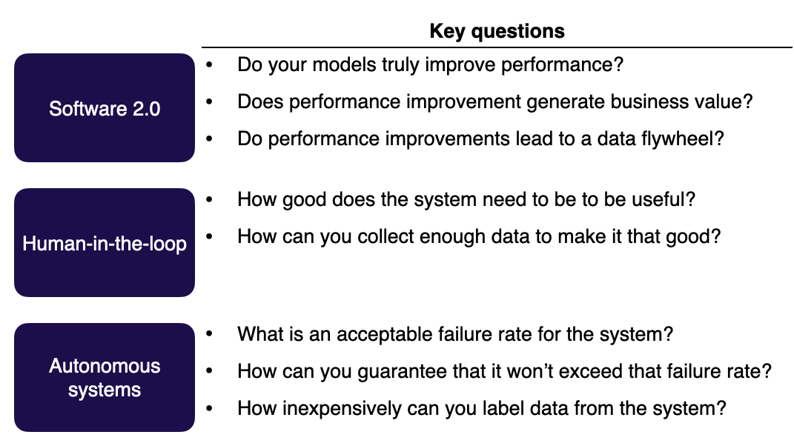

ML-powered product is a distinct but overlapping discipline. A lot of
what it takes to build a great ML-powered product goes beyond the
infrastructure side of ML systems. It focuses on how to fit ML into the
context of the product or the application that you're building. Other
topics in the scope of this ML product discipline include:

-   How do you understand how your users are interacting with your
model?

-   How do you build a team or an organization that can work together
effectively on ML systems?

-   How do you do product management in the context of ML?

-   What are the best practices for designing products that use ML as
part of them?

This class focuses on teaching you end-to-end what it takes to get a
product out in the world that uses ML and will cover aspects of MLOps
that are most critical in order to do that.

### Chapter Summary

1.  ML-powered products are going mainstream thanks to the
democratization of modeling.

2.  However, building great ML-powered products requires a different
process from building models.

3.  Full-Stack Deep Learning is here to help!

## 2 - When To Use Machine Learning

### When to Use ML At All

**ML projects have a higher failure rate than software projects in
general**. One reason that's worth acknowledging is that for many
applications, ML is fundamentally still research. Therefore, we
shouldn't aim for 100% success. Additionally, many ML projects are
doomed to fail even before they are undertaken due to a variety of
reasons:

1.  They are technically infeasible or poorly scoped.

2.  They never make the leap to a production environment.

3.  The broader organization is not all on the same page about what
would be considered success criteria for them.

4.  They solve the problem that you set out to solve but do not solve a
big enough problem to be worth the complexity.

The bar for your ML projects should be that **their value must outweigh
not just the cost of developing them but also the additional complexity
that these ML systems introduce to your software** (as introduced in the
classic paper "[[The High-Interest Credit Card of Technical
Debt]{.underline}](https://research.google/pubs/pub43146/)"). In brief,
ML systems erode the boundaries between other systems, rely on expensive
data dependencies, are commonly plagued by system design anti-patterns,
and are subject to the instability of the external world.

Before starting an ML project, ask yourself:

1.  **Are you ready to use ML?** More specifically, do you have a
product? Are you collecting data and storing it in a sane way? Do
you have the right people?

2.  **Do you really need ML to solve this problem?** More specifically,
do you need to solve the problem at all? Have you tried using
rules or simple statistics to solve the problem?

3.  **Is it ethical to use ML to solve this problem?** We'll have a
whole lecture about ethics!

### How to Pick Problems to Solve with ML

Just like any other project prioritization, you want to look for use
cases that have **high impact** and **low cost**:

1.  High-impact problems are likely to be those that address friction in
your product, complex parts of your pipeline, places where cheap
prediction is valuable, and generally what other people in your
industry are doing.

2.  Low-cost projects are those with available data, where bad
predictions are not too harmful.

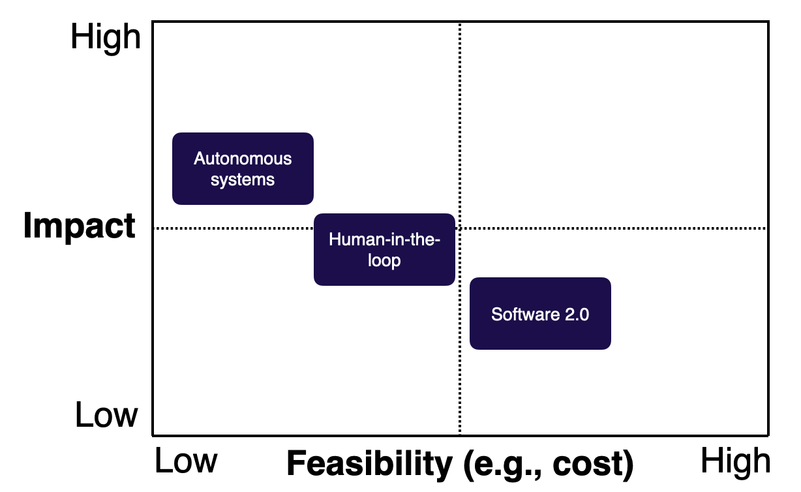

#### High-Impact Projects

Zooming into the mental models that you can use to find high-impact ML
projects:

1.  **Find problems where ML makes it economically feasible to solve
them**: A good resource here is the book "[[Prediction Machines:
The Simple Economics of
AI]{.underline}](https://www.amazon.com/Prediction-Machines-Economics-Artificial-Intelligence/dp/1633695670)."
The central thesis of the book is that AI reduces the cost of
prediction, which is central to decision-making. Therefore, look
for projects where cheap prediction will have a huge impact.

2.  **Think about what your product needs**: [[This article from the ML
team at
Spotify]{.underline}](https://spotify.design/article/three-principles-for-designing-ml-powered-products)
talks about the three principles for designing Discover Weekly,
one of Spotify's most powerful features.

3.  **Think about what types of problems that ML is particularly good
at**: An exploration of this mental model is the concept of
[[Software
2.0]{.underline}](https://karpathy.medium.com/software-2-0-a64152b37c35)
coined by Andrej Kaparthy. Essentially, if you have a part of your
system that is complex and manually defined, then that's
potentially a good candidate to be automated with ML.

4.  **Look at what other people in the industry are doing**: Generally,
you can read papers and blog posts from big tech and top
earlier-stage companies.

#### Low-Cost Projects

There are three main drivers for how much a project will cost:

1.  **Data availability**: How hard is it to acquire data? How expensive
is data labeling? How much data will be needed? How stable is the
data? What data security requirements do you have?

2.  **Accuracy requirement**: How costly are wrong predictions? How
frequently does the system need to be right to be useful? What are
the ethical implications of your model making wrong predictions?
It is noteworthy that **ML project costs tend to scale
super-linearly in the accuracy requirement**.

3.  **Problem difficulty**: Is the problem well-defined enough to be
solved with ML? Is there good published work on similar problems?
How much compute does it take to solve the problem? Generally,
it's hard to reason about what's feasible in ML.

#### What's Hard in ML?

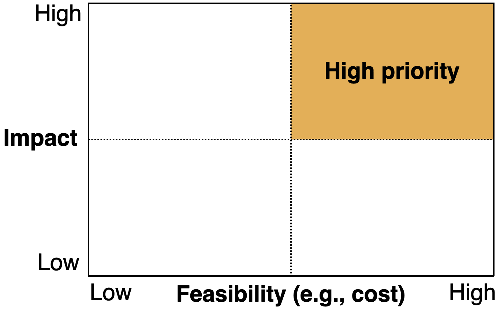

Here are the three types of hard problems:

1.  **Output is complex**: The model predictions are ambiguous or in a
high-dimensional structure.

2.  **Reliability is required**: ML systems tend to fail in all kinds of
unexpected ways, so anywhere where you need high precision or high
robustness is going to be more difficult to solve with ML.

3.  **Generalization is required**: These problems tend to be more in
the research domain. They can deal with out-of-distribution data
or do tasks such as reasoning, planning, or understanding
causality.

#### ML Feasibility Assessment

This is a quick checklist you can use to assess the feasibility of your
ML projects:

1.  Make sure that you actually need ML.

2.  Put in the work upfront to define success criteria with all of the
stakeholders.

3.  Consider the ethics of using ML.

4.  Do a literature review.

5.  Try to rapidly build a labeled benchmark dataset.

6.  Build a "minimum" viable model using manual rules or simple
heuristics.

7.  Answer this question again: "Are you sure that you need ML at all?"

### Not All ML Projects Should Be Planned The Same Way

Not all ML projects have the same characteristics; therefore, they
shouldn't be planned the same way. Understanding different archetypes of
ML projects can help select the right approach.

The three archetypes offered here are defined by how they interact with
real-world use cases:

1.  **Software 2.0 use cases**: Broadly speaking, this means taking
something that software or a product does in an automated fashion
today and augmenting its automation with machine learning.

    a.  An example of this would be improving code completion in the IDE
(like Github Copilot).

2.  **Human in the loop systems:** Machine learning can be applied for
tasks where automation is not currently deployed, but where humans
could have their judgment or efficiency augmented. Simply put,
helping humans do their jobs better by complementing them with
ML-based tools.

    a.  An example of this would be turning sketches into slides, a
process will usually involve humans approving the output of a
machine learning model that made the slides.

3.  **Autonomous systems:** Systems that apply machine learning to
augment existing or implement new processes with no human input.

    a.  An example of this would be full self-driving, where there is no
opportunity for a driver to intervene in the functioning of
the car.

For each archetype, there are some key considerations inform how you
should go about planning projects.

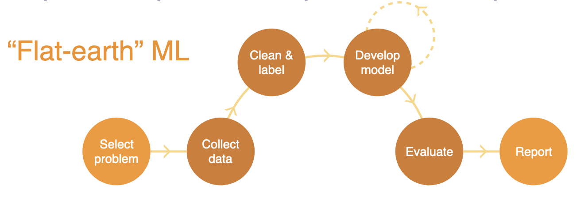

In the case of Software 2.0 projects, you should focus more on
understanding how impactful the performance of the new model. Is the
model truly much better? How can the performance continue to increase
across iterations?

In the case of human-in-the-loop systems, consider more the context of
the human user and what their needs might be. How good does the system
actually have to be to improve the life of a human reviewing its output?
In some cases, a model that does even 10% better with accuracy
(nominally a small increase) might have outsize impacts for human users
in the loop.

For autonomous systems, focus heavily on the failure rate and its
consequences. When there is no opportunity for human intervention, as is
the case with autonomous systems, failures need to be carefully
monitored to ensure outsize harm doesn't occur. Self-driving cars are an
excellent example of an autonomous system where failure rates are
carefully monitored.

As you build a software 2.0 project, strongly consider the concept of
the **data flywheel**. For certain ML projects, as you improve your
model, your product will get better and more users will engage with the
product, thereby generating more data for the model to get even better.
It's a classic virtuous cycle and truly the gold standard for ML
projects.

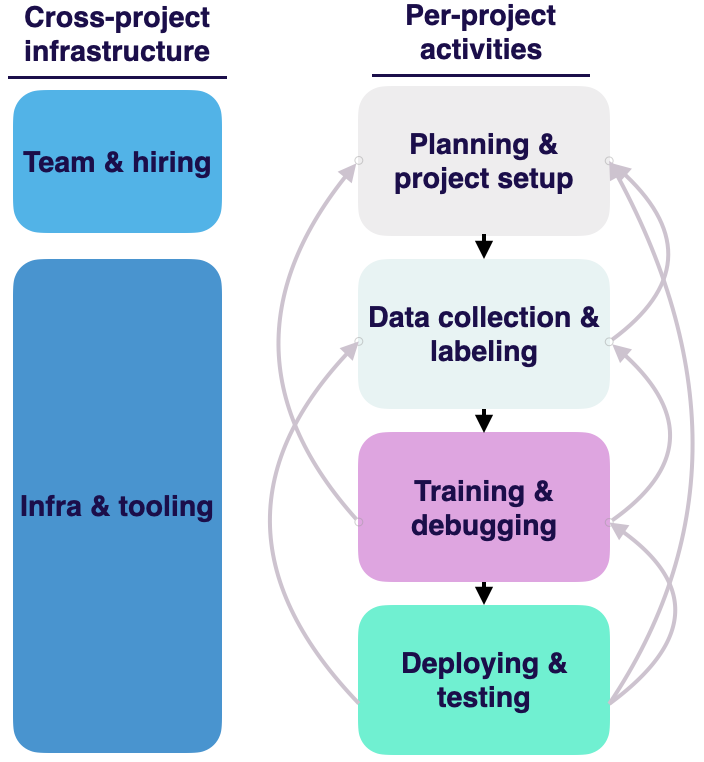

As you consider implementing data flywheels, remember to know the answer
to these three questions:

1.  **Do you have a data loop?** To build a data flywheel, you crucially
need to be able to get labeled data from users in a scalable
fashion. This increasing access to quality data defines a data
loop.

2.  **Can you turn more data into a better model?** This somewhat falls
onto you as the modeling expert, but it may also not be the case
that more data leads to significantly better performance. Make
sure you can actually translate data scale into better model
performance.

3.  **Does better model performance lead to better product use?** You
need to verify that improvements with models are actually tied to
users enjoying the product more and benefiting from it!

Going back to our impact v. feasibility matrix, our three product
archetypes differ across the spectrum.

This is a pretty intuitive evaluation you can apply to all your ML
projects; if it's harder to build (like autonomous systems), it's likely
to have greater impact! There are ways, however, to change this matrix
in the context of specific projects.

-   For Software 2.0, data flywheels can magnify impact by allowing
models to get much better and increase customer delight over time.

-   For human-in-the-loop systems, you can increase feasibility by
leveraging good product design. Thoughtful design can help reduce
expectations and accuracy requirements. Alternatively, a "good
enough" mindset that prioritizes incremental delivery over time
can make such systems more feasible.

-   For autonomous systems, leveraging humans in the loop can make
development more feasible by adding guardrails and reducing the
potential impact of failures.

### Just Get Started!

With all this discussion about archetypes and impact matrices, don't
forget the most important component of engineering: **actually
building**! Dive in and get started. Start solving problems and iterate
on solutions.

One common area practitioners trip up in is **tool fetishization.** As
MLOps and production machine learning has flourished, so too has the
number of tools and platforms that address various aspects of the ML
process. You don't need to be perfect with your tooling before getting
started with driving value from machine learning. Just because Google
and Uber are doing things in a very structured, at-scale way doesn't
mean you need to as well!

In this course, we will primarily focus on how to set things up the
right way to do machine learning in production, without overcomplicating
it. This is an ML products-focused class, not an MLOps class! Check out
this talk by Jacopo Tagliabue describing [[MLOps at Reasonable
Scale]{.underline}](https://www.youtube.com/watch?v=Ndxpo4PeEms) for a
great exposition of this mindset.

## 3 - Lifecycle

ML adds complexity to projects and isn't always a value driver. Once you
know, however, that it's the right addition to your project, what does
the actual lifecycle look like? What steps do we embark upon as we
execute?

In this course, the common running example we use is of a pose
estimation problem. We'll use this as a case study to demonstrate the
lifecycle and illustrate various points about ML-powered products.

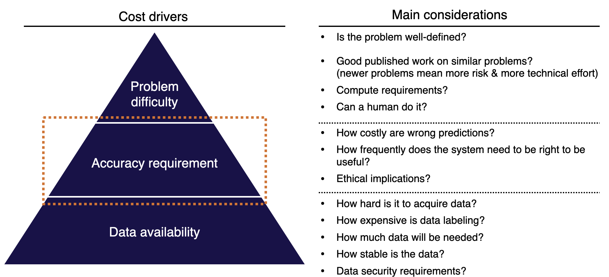

Here's a graphic that visualizes the lifecycle of ML projects:

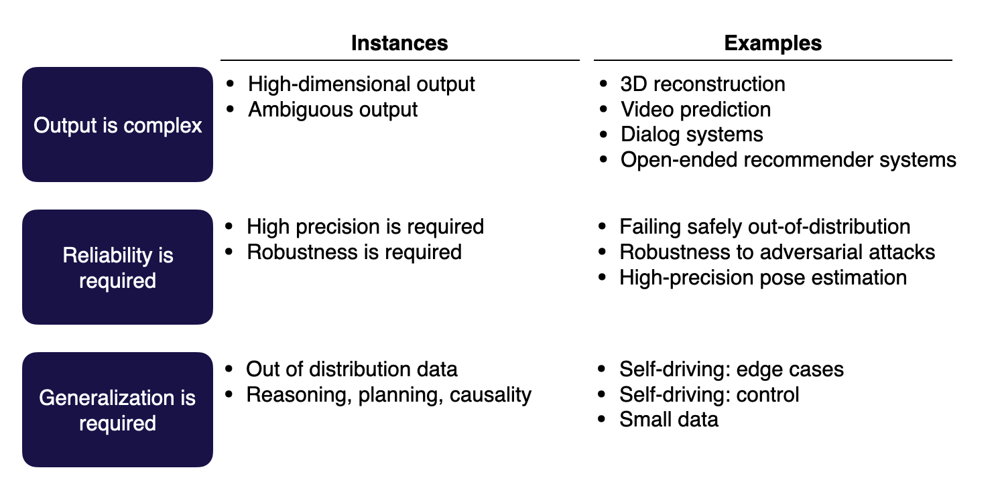

It provides a very helpful structure. Watch from 48:00 to 54:00 to dive
deeper into how this lifecycle occurs in the context of a real machine
learning problem around pose estimation that Josh worked on at OpenAI.
Let's comment on some specific nuances:

-   Machine learning projects tend to be very iterative. Each of these
phases can feed back into any of the phases before, as you learn
more about the problem that you\'re working on.

    -   For example, you might realize that "Actually, it\'s way too
hard for us to get data in order to solve this problem!", or
"It\'s really difficult for us to label the pose of these
objects in 3D space".

    -   A solution might actually be to go back a step in the lifecycle
and setup the problem differently. For example, what if it
were cheaper to annotate per pixel?

    -   This could repeat itself multiple times, as you progress through
a project. It's a normal and expected part of the machine
learning product development process.

-   In addition to iteration during execution, there's cross-project
"platform" work that matters too! Hiring and infrastructure
development are crucial to the long-term health of your project.

-   Going through this lifecycle and winning each step is what we'll
cover in this class!

In summary, here's what we covered in this lecture:

1.  ML is NOT a cure-all. It's a complex technology that needs to be
used thoughtfully.

2.  You DON'T a perfect start up to get going. Start building and
iterate!

3.  The lifecycle of machine learning is purposefully iterative and
circuitous. We'll learn how to master this process together!
