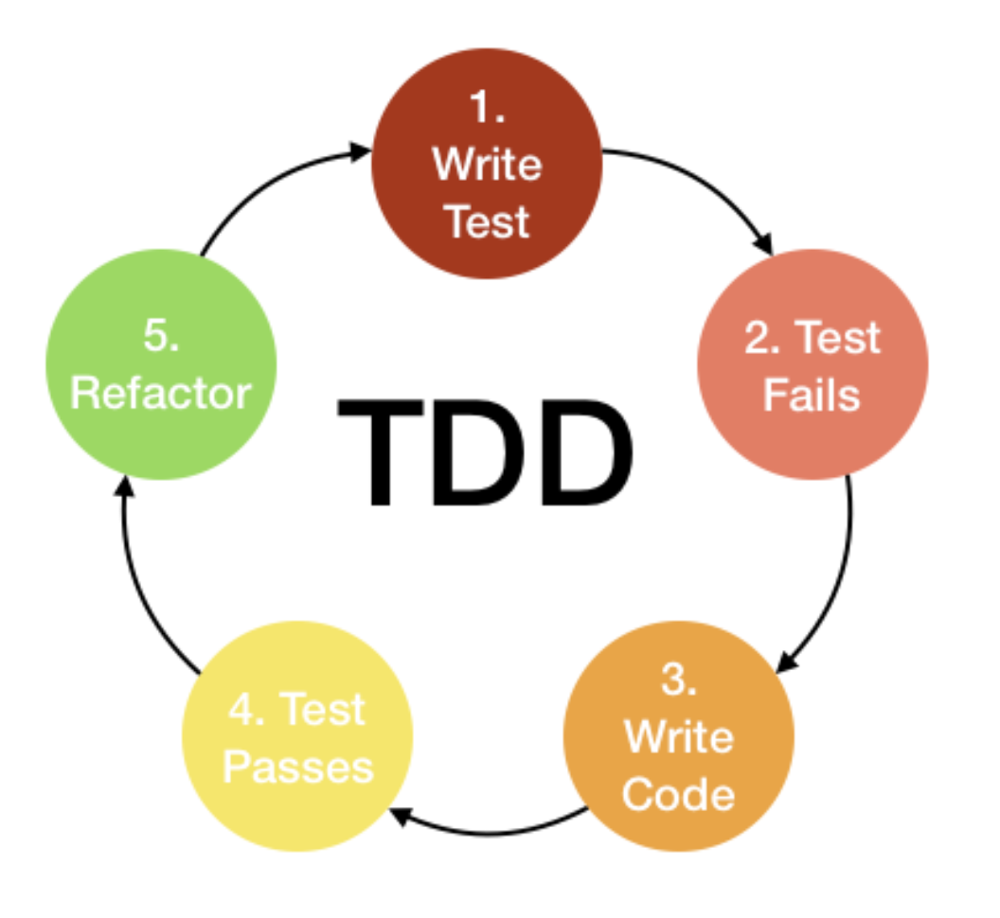
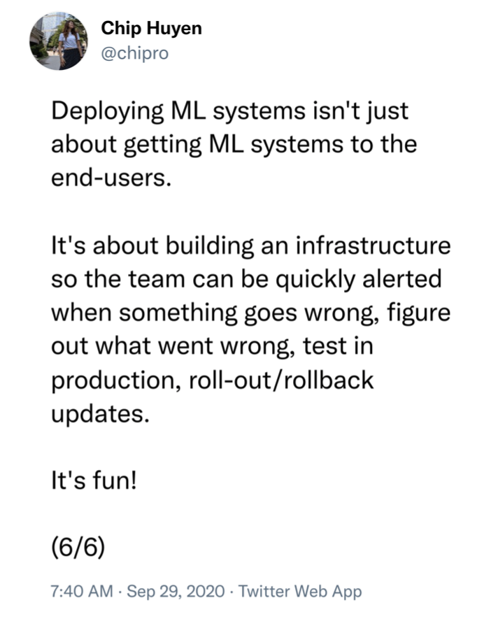
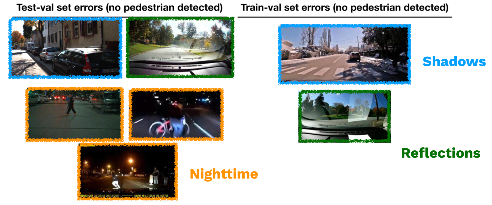
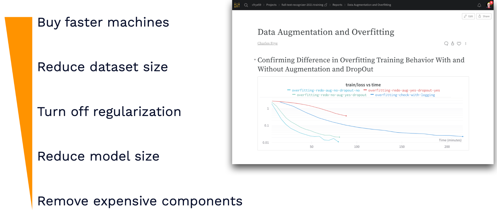
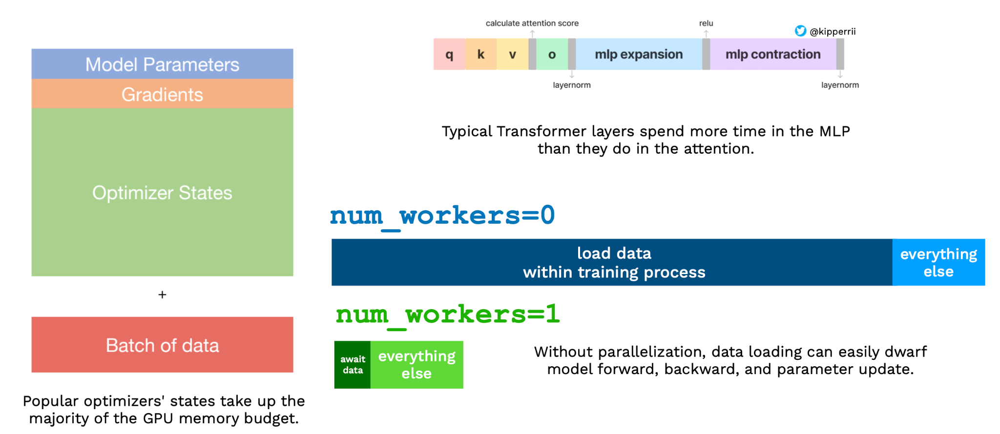
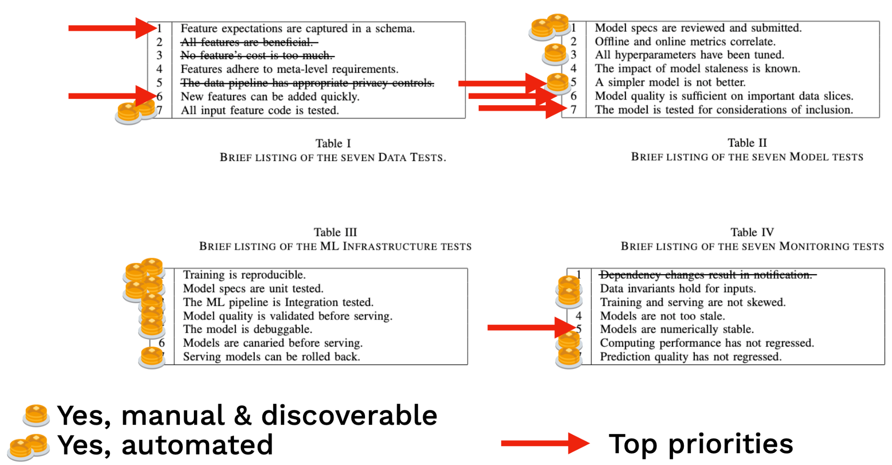

# Lecture 3: Troubleshooting & Testing

<iframe width="720" height="405" src="https://www.youtube-nocookie.com/embed/RLemHNAO5Lw?list=PL1T8fO7ArWleMMI8KPJ_5D5XSlovTW_Ur" title="YouTube video player" frameborder="0" allow="accelerometer; autoplay; clipboard-write; encrypted-media; gyroscope; picture-in-picture" allowfullscreen></iframe>

Lecture by [Charles Frye](https://twitter.com/charles_irl). 
Notes by [James Le](https://twitter.com/le_james94) and [Vishnu Rachakonda](https://www.linkedin.com/in/vrachakonda/). 
Published August 22, 2022.
[Download slides](https://fsdl.me/2022-lecture-03-slides).

## 1 - Testing Software

1.  The general approach is that tests will help us ship faster with
fewer bugs, but they won't catch all of our bugs.

2.  That means we will use testing tools but won't try to achieve 100%
coverage.

3.  Similarly, we will use linting tools to improve the development
experience but leave escape valves rather than pedantically
following our style guides.

4.  Finally, we'll discuss tools for automating these workflows.

### 1.1 - Tests Help Us Ship Faster. They Don't Catch All Bugs

**Tests are code we write that are designed to fail intelligibly when
our other code has bugs**. These tests can help catch some bugs before
they are merged into the main product, but they can't catch all bugs.
The main reason is that test suites are not certificates of correctness.
In some formal systems, tests can be proof of code correctness. But we
are writing in Python (a loosely goosey language), so all bets are off
in terms of code correctness.

[Nelson Elhage](https://twitter.com/nelhage?lang=en)
framed test suites more like classifiers. The classification problem is:
does this commit have a bug, or is it okay? The classifier output is
whether the tests pass or fail. We can then **treat test suites as a
"prediction" of whether there is a bug**, which suggests a different way
of designing our test suites.

When designing classifiers, we need to trade off detection and false
alarms. **If we try to catch all possible bugs, we can inadvertently
introduce false alarms**. The classic signature of a false alarm is a
failed test - followed by a commit that fixes the test rather than the
code.

To avoid introducing too many false alarms, it's useful to ask yourself
two questions before adding a test:

1.  Which real bugs will this test catch?

2.  Which false alarms will this test raise?

If you can think of more examples for the second question than the first
one, maybe you should reconsider whether you need this test.

One caveat is that: **in some settings, correctness is important**.
Examples include medical diagnostics/intervention, self-driving
vehicles, and banking/finance. A pattern immediately arises here: If you
are operating in a high-stakes situation where errors have consequences
for people's lives and livelihoods, even if it's not regulated yet, it
might be regulated soon. These are examples of **low-feasibility,
high-impact ML projects** discussed in the first lecture.

### 1.2 - Use Testing Tools, But Don't Chase Coverage

-   *[Pytest](https://docs.pytest.org/)* is the standard
tool for testing Python code. It has a Pythonic implementation and
powerful features such as creating separate suites, sharing
resources across tests, and running parametrized variations of
tests.

-   Pure text docs can't be checked for correctness automatically, so
they are hard to maintain or trust. Python has a nice module,
[*[doctests]*](https://docs.python.org/3/library/doctest.html),
for checking code in the documentation and preventing rot.

-   Notebooks help connect rich media (charts, images, and web pages)
with code execution. A cheap and dirty solution to test notebooks
is adding some *asserts* and using *nbformat* to run the
notebooks.

Once you start adding different types of tests and your codebase grows,
you will want coverage tools for recording which code is checked or
"covered" by tests. Typically, this is done in lines of code, but some
tools can be more fine-grained. We recommend
[Codecov](https://about.codecov.io/), which generates nice
visualizations you can use to drill down and get a high-level overview
of the current state of your testing. Codecov helps you understand your
tests and can be incorporated into your testing. You can say you want to
reject commits not only where tests fail, but also where test coverage
goes down below a certain threshold.

However, we recommend against that. Personal experience, interviews, and
published research suggest that only a small fraction of the tests you
write will generate most of your value. **The right tactic,
engineering-wise, is to expand the limited engineering effort we have on
the highest-impact tests and ensure that those are super high quality**.
If you set a coverage target, you will instead write tests in order to
meet that coverage target (regardless of their quality). You end up
spending more effort to write tests and deal with their low quality.

### 1.3 - Use Linting Tools, But Leave Escape Valves

**Clean code is of uniform and standard style**.

1.  Uniform style helps avoid spending engineering time on arguments
over style in pull requests and code review. It also helps improve
the utility of our version control by cutting down on noisy
components of diffs and reducing their size. Both benefits make it
easier for humans to visually parse the diffs in our version
control system and make it easier to build automation around them.

2.  Standard style makes it easier to accept contributions for an
open-source repository and onboard new team members for a
closed-source system.

One aspect of consistent style is consistent code formatting (with
things like whitespace). The standard tool for that in Python is
[the] *[black]* [Python
formatter](https://github.com/psf/black). It's a very
opinionated tool with a fairly narrow scope in terms of style. It
focuses on things that can be fully automated and can be nicely
integrated into your editor and automated workflows.

For non-automatable aspects of style (like missing docstrings), we
recommend [*[flake8]*](https://flake8.pycqa.org/). It comes
with many extensions and plugins such as docstring completeness, type
hinting, security, and common bugs.

ML codebases often have both Python code and shell scripts in them.
Shell scripts are powerful, but they also have a lot of sharp edges.
*[shellcheck](https://www.shellcheck.net/)* knows all the
weird behaviors of bash that often cause errors and issues that aren't
immediately obvious. It also provides explanations for why it's raising
a warning or an error. It's very fast to run and can be easily
incorporated into your editor.

One caveat to this is: **pedantic enforcement of style is obnoxious.**
To avoid frustration with code style and linting, we recommend:

1.  Filtering rules down to the minimal style that achieves the goals we
set out (sticking with standards, avoiding arguments, keeping
version control history clean, etc.)

2.  Having an "opt-in" application of rules and gradually growing
coverage over time - which is especially important for existing
codebases (which may have thousands of lines of code that we need
to be fixed).

### 1.4 - Always Be Automating

**To make the best use of testing and linting practices, you want to
automate these tasks and connect to your cloud version control system
(VCS)**. Connecting to the VCS state reduces friction when trying to
reproduce or understand errors. Furthermore, running things outside of
developer environments means that you can run tests automatically in
parallel to other development work.

Popular, open-source repositories are the best place to learn about
automation best practices. For instance, the PyTorch Github library has
tons of automated workflows built into the repo - such as workflows that
automatically run on every push and pull.

The tool that PyTorch uses (and that we recommend) is [GitHub
Actions](https://docs.github.com/en/actions), which ties
automation directly to VCS. It is powerful, flexible, performant, and
easy to use. It gets great documentation, can be used with a YAML file,
and is embraced by the open-source community. There are other options
such as pre-commit.ci, CircleCI, and Jenkins; but GitHub Actions seems
to have won the hearts and minds in the open-source community in the
last few years.

To keep your version control history as clean as possible, you want to
be able to run tests and linters locally before committing. We recommend
*[pre-commit](https://github.com/pre-commit/pre-commit)*
to enforce hygiene checks. You can use it to run formatting, linting,
etc. on every commit and keep the total runtime to a few seconds.
*pre-commit* is easy to run locally and easy to automate with GitHub
Actions.

**Automation to ensure the quality and integrity of our software is a
productivity enhancer.** That's broader than just CI/CD. Automation
helps you avoid context switching, surfaces issues early, is a force
multiplier for small teams, and is better documented by default.

One caveat is that: **automation requires really knowing your tools.**
Knowing Docker well enough to use it is not the same as knowing Docker
well enough to automate it. Bad automation, like bad tests, takes more
time than it saves. Organizationally, that makes automation a good task
for senior engineers who have knowledge of these tools, have ownership
over code, and can make these decisions around automation.

### Summary

1.  Automate tasks with GitHub Actions to reduce friction.

2.  Use the standard Python toolkit for testing and cleaning your
projects.

3.  Choose testing and linting practices with the 80/20 principle,
shipping velocity, and usability/developer experience in mind.

## 2 - Testing ML Systems

1.  Testing ML is hard, but not impossible.

2.  We should stick with the low-hanging fruit to start.

3.  Test your code in production, but don't release bad code.

### 2.1 - Testing ML Is Hard, But Not Impossible

Software engineering is where many testing practices have been
developed. In software engineering, we compile source code into
programs. In machine learning, training compiles data into a model.
These components are harder to test:

1.  Data is heavier and more inscrutable than source code.

2.  Training is more complex and less well-defined.

3.  Models have worse tools for debugging and inspection than compiled
programs.

In this section, we will focus primarily on "smoke" tests. These tests
are easy to implement and still effective. They are among the 20% of
tests that get us 80% of the value.

### 2.2 - Use Expectation Testing on Data

**We test our data by checking basic properties**. We express our
expectations about the data, which might be things like there are no
nulls in this column or the completion date is after the start date.
With expectation testing, you will start small with only a few
properties and grow them slowly. You only want to test things that are
worth raising alarms and sending notifications to others.

We recommend
[*[great_expectations]*](https://greatexpectations.io/) for
data testing. It automatically generates documentation and quality
reports for your data, in addition to built-in logging and alerting
designed for expectation testing. To get started, check out [this
MadeWithML tutorial on
great_expectations](https://github.com/GokuMohandas/testing-ml).

To move forward, you want to stay as close to the data as possible:

1.  A common pattern is that there's a benchmark dataset with
annotations (in academia) or an external annotation team (in the
industry). A lot of the detailed information about that data can
be extracted by simply looking at it.

2.  One way for data to get internalized into the organization is that
at the start of the project, model developers annotate data ad-hoc
(especially if you don't have the budget for an external
annotation team).

3.  However, if the model developers at the start of the project move on
and more developers get onboarded, that knowledge is diluted. A
better solution is an internal annotation team that has a regular
information flow with the model developers is a better solution.

4.  The best practice ([recommended by Shreya
Shankar](https://twitter.com/sh_reya/status/1521903046392877056))
is t**o have a regular on-call rotation where model developers
annotate data themselves**. Ideally, these are fresh data so that
all members of the team who are developing models know about the
data and build intuition/expertise in the data.