## 1 - Introduction

One thing people don't quite get as they enter the field of ML is how
much of it deals with data - putting together datasets, exploring the
data, wrangling the data, etc. The key points of this lecture are:

1.  Spend 10x as much time exploring the data as you would like to.

2.  Fixing, adding, and augmenting the data is usually the best way to
improve performance.

3.  Keep it all simple!

## 2 - Data Sources

There are many possibilities for the sources of data. You might have
images, text files, logs, or database records. In deep learning, you
need to get that data into a local filesystem disk next to a GPU. **How
you send data from the sources to training is different for each
project**.

-   With images, you can simply download them from S3.

-   With text files, you need to process them in some distributed way,
analyze the data, select a subset, and put that on a local
machine.

-   With logs and database records, you can use a data lake to aggregate
and process the data.

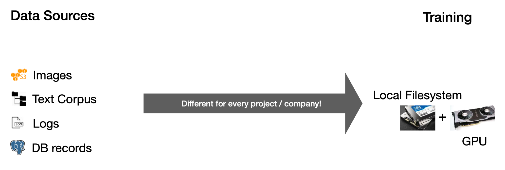

The basics will be the same - a filesystem, object storage, and
databases.

### Filesystem

The **filesystem** is a fundamental abstraction. Its fundamental unit is
a file - which can be text or binary, is not versioned, and is easily
overwritten. The filesystem is usually on a disk connected to your
machine - physically connected on-prem, attached in the cloud, or even
distributed.

The first thing to know about discs is that their speed and bandwidth
range - from hard discs to solid-state discs. There are two orders of
magnitude differences between the slowest (SATA SSD) and the fastest
(NVMe SSD) discs. Below are some latency numbers you should know, with
the human-scale numbers in parentheses:

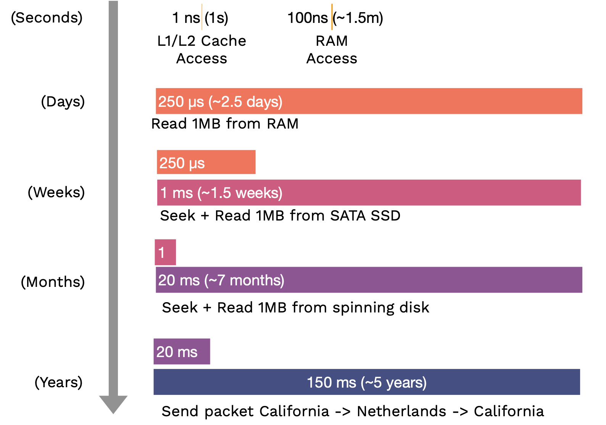

What formats should the data be stored on the local disc?

-   If you work with binary data like images and audio, just use the
standard formats like JPEG or MP3 that it comes in.

-   If you work with metadata (like labels), tabular data, or text data,
then compressed JSON or text files are just fine. Alternatively,
Parquet is a table format that is fast, compact, and widely used.

### Object Storage

The **object storage** is an API over the filesystem. Its fundamental
unit is an object, usually in a binary format (an image, a sound file, a
text file, etc.). We can build versioning or redundancy into the object
storage service. It is not as fast as the local filesystem, but it can b
fast enough within the cloud.

### Databases

**Databases** are persistent, fast, and scalable storage and retrieval
of structured data systems. A helpful mental model for this is: all the
data that the databases hold is actually in the computer\'s RAM, but the
database software ensures that if the computer gets turned off,
everything is safely persisted to disk. If too much data is in the RAM,
it scales out to disk in a performant way.

You should not store binary data in the database but the object-store
URLs instead. [Postgres](https://www.postgresql.org/) is
the right choice most of the time. It is an open-source database that
supports unstructured JSON and queries over that JSON.
[SQLite](https://www.sqlite.org/) is also perfectly good
for small projects.

Most coding projects that deal with collections of objects that
reference each other will eventually implement a crappy database. Using
a database from the beginning with likely save you time. In fact, most
MLOps tools are databases at their core (e.g.,
[W&B](https://wandb.ai/site) is a database of experiments,
[HuggingFace Hub](https://huggingface.co/models) is a
database of models, and [Label
Studio](https://labelstud.io/) is a database of labels).

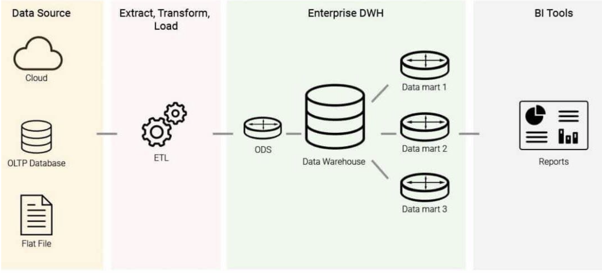

**Data warehouses** are stores for online analytical processing (OLAP),
as opposed to databases being the data stores for online transaction
processing (OLTP). You get data into the data warehouse through a
process called **ETL (Extract-Transform-Load)**: Given a number of data
sources, you extract the data, transform it into a uniform schema, and
load it into the data warehouse. From the warehouse, you can run
business intelligence queries. The difference between OLAP and OLTP is
that: OLAPs are column-oriented, while OLTPs are row-oriented.

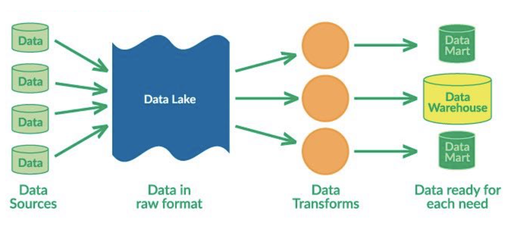

**Data lakes** are unstructured aggregations of data from multiple
sources. The main difference between them and data warehouses is that
data lakes use ELT (Extract-Load-Transform) process: dumping all the
data in and transforming them for specific needs later.

**The big trend is unifying both data lake and data warehouse, so that
structured data and unstructured data can live together**. The two big
platforms for this are
[Snowflake](https://www.snowflake.com/) and
[Databricks](https://www.databricks.com/). If you are
really into this stuff, "[Designing Data-Intensive
Applications](https://dataintensive.net/)" is a great book
that walks through it from first principles.

## 3 - Data Exploration

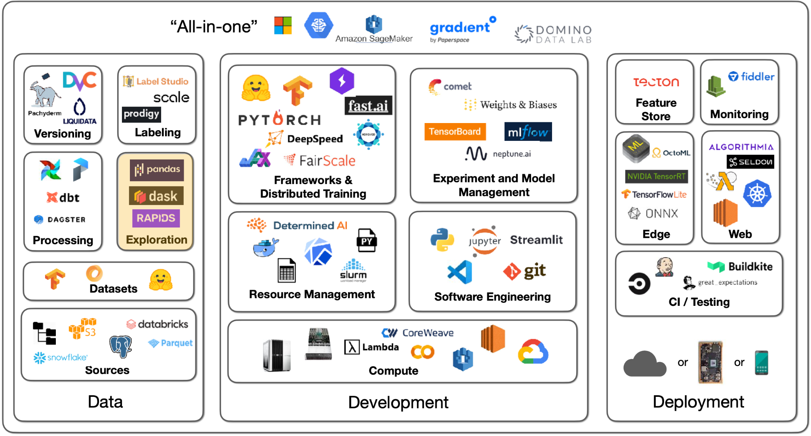

To explore the data, you must speak its language, mostly SQL and,
increasingly, DataFrame. **SQL** is the standard interface for
structured data, which has existed for decades. **Pandas** is the main
DataFrame in the Python ecosystem that lets you do SQL-like things. Our
advice is to become fluent in both to interact with both transactional
databases and analytical warehouses and lakes.

[Pandas](https://pandas.pydata.org/) is the workhorse of
Python data science. You can try [DASK
DataFrame](https://examples.dask.org/dataframe.html) to
parallelize Pandas operations over cores and
[RAPIDS](https://rapids.ai/) to do Pandas operations on
GPUs.

## 4 - Data Processing

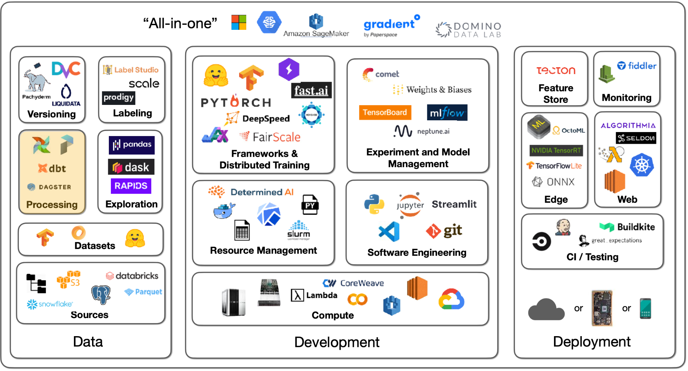

Talking about data processing, it's useful to have a motivational
example. Let's say we have to train a photo popularity predictor every
night. For each photo, the training data must include:

1.  Metadata (such as posting time, title, and location) that sits in
the database.

2.  Some features of the user (such as how many times they logged in
today) that are needed to be computed from logs.

3.  Outputs of photo classifiers (such as content and style) that are
needed to run the classifiers.

Our ultimate task is to train the photo predictor model, but we need to
output data from the database, compute the logs, and run classifiers to
output their predictions. As a result, we have **task dependencies**.
Some tasks can't start until others are finished, so finishing a task
should kick off its dependencies.

Ideally, dependencies are not always files but also programs and
databases. We should be able to spread this work over many machines and
execute many dependency graphs all at once.

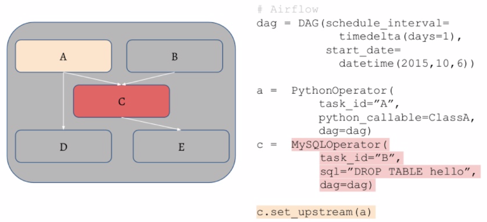

-   [Airflow](https://airflow.apache.org/) is a standard
scheduler for Python, where it's possible to specify the DAG
(directed acyclic graph) of tasks using Python code. The operator
in that graph can be SQL operations or Python functions.

-   To distribute these jobs, the workflow manager has a queue for the
tasks and manages the workers that pull from them. It will restart
jobs if they fail and ping you when the jobs are finished.

-   [Prefect](https://www.prefect.io/) and
[Dagster](https://dagster.io/) are contenders to
improve and replace Airflow in the long run.

The primary advice here is not to **over-engineer things**. You can get
machines with many CPU cores and a lot of RAM nowadays. For example,
UNIX has powerful parallelism, streaming, and highly optimized tools.

## 5 - Feature Store

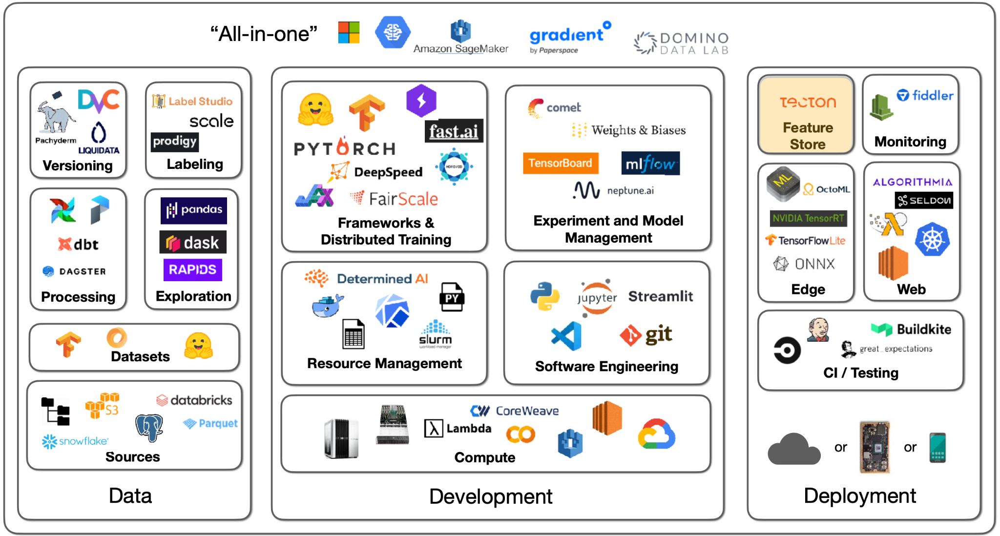

Let's say your data processing generates artifacts you need for
training. How do you make sure that, in production, the trained model
sees the same processing taking place (which happened during training)?
How do you avoid recomputation during retraining?

**Feature stores** are a solution to this (that you may not need!).

-   The first mention of feature stores came from [this Uber blog post
describing their ML platform,
Michelangelo](https://eng.uber.com/michelangelo-machine-learning-platform/).
They had an offline training process and an online prediction
process, so they built an internal feature store for both
processes to be in sync.

-   [Tecton](https://www.tecton.ai/) is the leading SaaS
solution to feature store.

-   [Feast](https://feast.dev/) is a common open-source
option.

-   [Featureform](https://www.featureform.com/) is a
relatively new option.

## 6 - Datasets

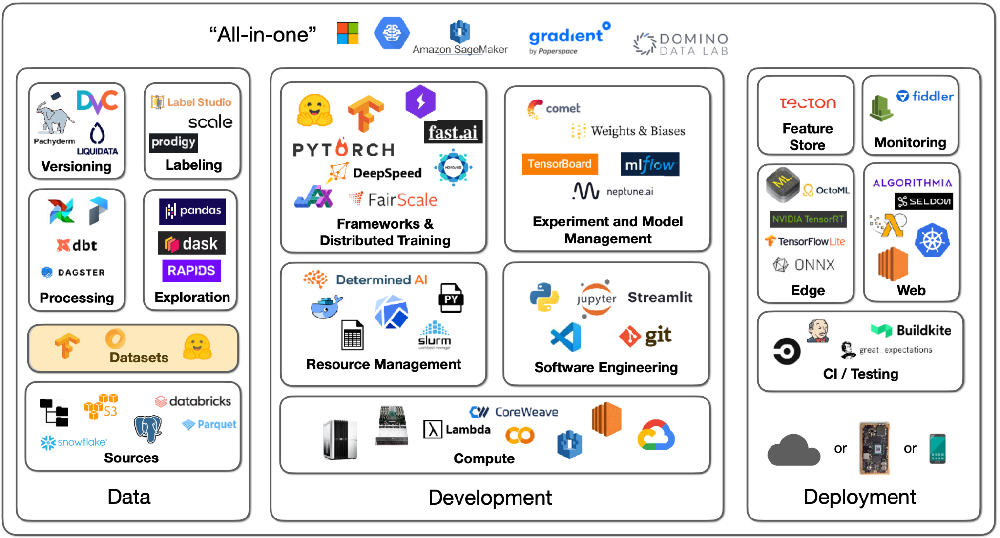

What about datasets specifically made for machine learning?

[HuggingFace
Datasets](https://huggingface.co/docs/datasets) is a great
source of machine learning-ready data. There are 8000+ datasets covering
a wide variety of tasks, like computer vision, NLP, etc. The Github-Code
dataset on HuggingFace is a good example of how these datasets are
well-suited for ML applications. Github-Code can be streamed, is in the
modern Apache Parquet format, and doesn't require you to download 1TB+
of data in order to properly work with it. Another sample dataset is
RedCaps, which consists of 12M image-text pairs from Reddit.

Another interesting dataset solution for machine learning is
[Activeloop](https://www.activeloop.ai/). This tool is
particularly well equipped to work with data and explore samples without
needing to download it.

## 7 - Data Labeling

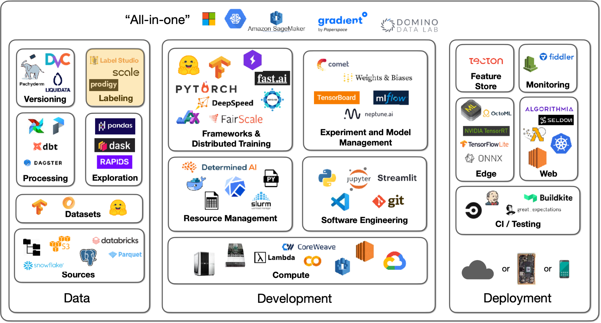

### No Labeling Required

The first thing to talk about when it comes to labeling data
is...**maybe we don\'t have to label data?** There are a couple of
options here we will cover.

**Self-supervised learning** is a very important idea that allows you to
avoid painstakingly labeling all of your data. You can use parts of your
data to label other parts of your data. This is very common in NLP right
now. This is further covered in the foundation model lecture. The long
and short of it is that models can have elements of their data masked
(e.g., the end of a sentence can be omitted), and models can use earlier
parts of the data to predict the masked parts (e.g., I can learn from
the beginning of the sentence and predict the end). This can even be
used across modalities (e.g., computer vision *and* text), as [OpenAI
CLIP](https://github.com/openai/CLIP) demonstrates.

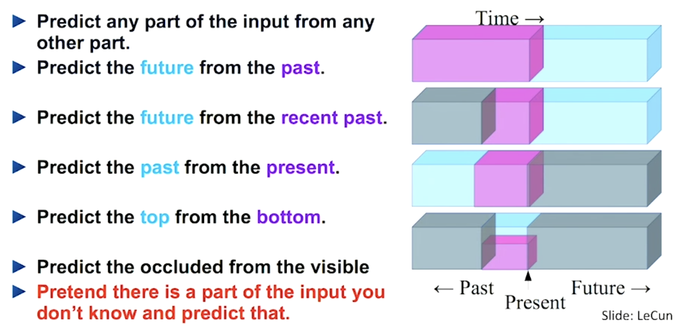

**Image data augmentation** is an almost compulsory technique to adopt,
especially for vision tasks. Frameworks like
[torchvision](https://github.com/pytorch/vision) help with
this. In data augmentation, samples are modified (e.g., brightened)
without actually changing their core "meaning." Interestingly,
augmentation can actually replace labels.
[SimCLR](https://ai.googleblog.com/2020/04/advancing-self-supervised-and-semi.html)
is a model that demonstrates this - where its learning objective is to
maximize agreement between augmented views of the same image and
minimize agreement between different images.

For other forms of data, there are a couple of augmentation tricks that
can be applied. You can delete some cells in tabular data to simulate
missing data. In text, there aren't established techniques, but ideas
include changing the order of words or deleting words. In speech, you
could change the speed, insert pauses, etc.

**Synthetic data** is an underrated idea. You can synthesize data based
on your knowledge of the label. For example, you can [create
receipts](https://github.com/amoffat/metabrite-receipt-tests)
if your need is to learn how to recognize receipts from images. This can
get very sophisticated and deep, so tread carefully.

You can also get creative and ask your users to label data for you.
Google Photos, as any user of the app knows, regularly gets users to
label images about where people in photos are the same or different.

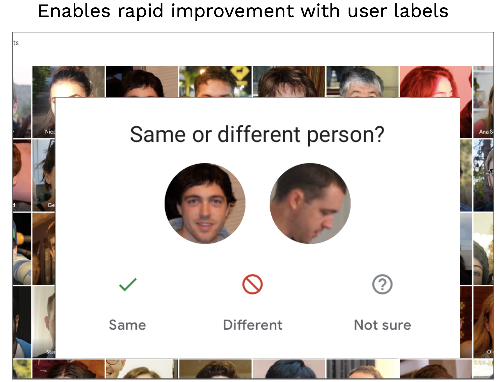

This is an example of the data flywheel. Improving the data allows the
user to improve the model, which in turn makes their product experience
better.

### Labeling Solutions

These are all great options for avoiding labeling data. However,
**you'll usually have to label some data to get started.**

Labeling has standard annotation features, like bounding boxes, that
help capture information properly. Training annotators properly is more
important than the particular kind of annotation. Standardizing how
annotators approach a complex, opinable task is crucial. Labeling
guidelines can help capture the exact right label from an annotator.
Quality assurance is key to ensuring annotation and labeling are
happening properly.

There are a few options for sourcing labor for annotations:

1.  Full-service data labeling vendors offer end-to-end labeling
solutions.

2.  You can hire and train annotators yourself.

3.  You can crowdsource annotation on a platform like Mechanical Turk.

**Full-service companies offer a great solution that abstracts the need
to build software, manage labor, and perform quality checks**. It makes
sense to use one. Before settling on one, make sure to dedicate time to
vet several. Additionally, label some gold standard data yourself to
understand the data yourself and to evaluate contenders. Take calls with
several contenders, ask for work samples on your data, and compare them
to your own labeling performance.

-   [Scale AI](https://scale.com/) is the dominant data
labeling solution. It offers an API that allows you to spin up
tasks.

-   Additional contenders include
[Labelbox](https://labelbox.com/) and
[Supervisely](https://supervise.ly/).

-   [LabelStudio](https://labelstud.io/) is an open-source
solution for performing annotation yourself, with a companion
enterprise version. It has a great set of features that allow you
to design your interface and even plug-in models for active
learning!

-   [Diffgram](https://diffgram.com/) is a competitor to
Label Studio.

-   Recent offerings, like
[Aquarium](https://www.aquariumlearning.com/) and
[Scale Nucleus](https://scale.com/nucleus), have
started to help concentrate labeling efforts on parts of the
dataset that are most troublesome for models.

-   [Snorkel](https://snorkel.ai/) is a dataset management
and labeling platform that uses weak supervision, which is a
similar concept. You can leverage composable rules (e.g., all
sentences that have the term "amazing" are positive sentiments)
that allow you to quickly label data faster than if you were to
treat every data point the same.

In conclusion, try to avoid labeling using techniques like
self-supervised learning. If you can't, use labeling software and
eventually outsource the work to the right vendor. If you can't afford
vendors, consider hiring part-time work rather than crowdsourcing the
work to ensure quality.

## 8 - Data Versioning

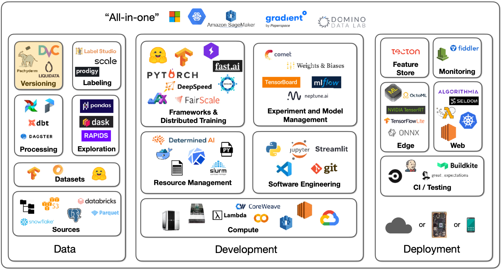

Data versioning comes with a spectrum of approaches:

1.  Level 0 is bad. In this case, data just lives on some file system.
In these cases, the issue arises because the models are
unversioned since their data is unversioned. Models are part code,
part data. This will lead to the consequence of being unable to
get back to a previous level of performance if need be.

2.  You can prevent this event with Level 1, where you snapshot your
data each time you train. This somewhat works but is far from
ideal.

3.  In Level 2, data is versioned like code, as a commingled asset with
versioned code. You can use a system like
[git-lfs](https://git-lfs.github.com/) that allows
you to store large data assets alongside code. This works really
well!

4.  Level 3 involves specialized solutions for working with large data
files, but this may not be needed unless you have a very specific
need (i.e., uniquely large or compliance-heavy files).

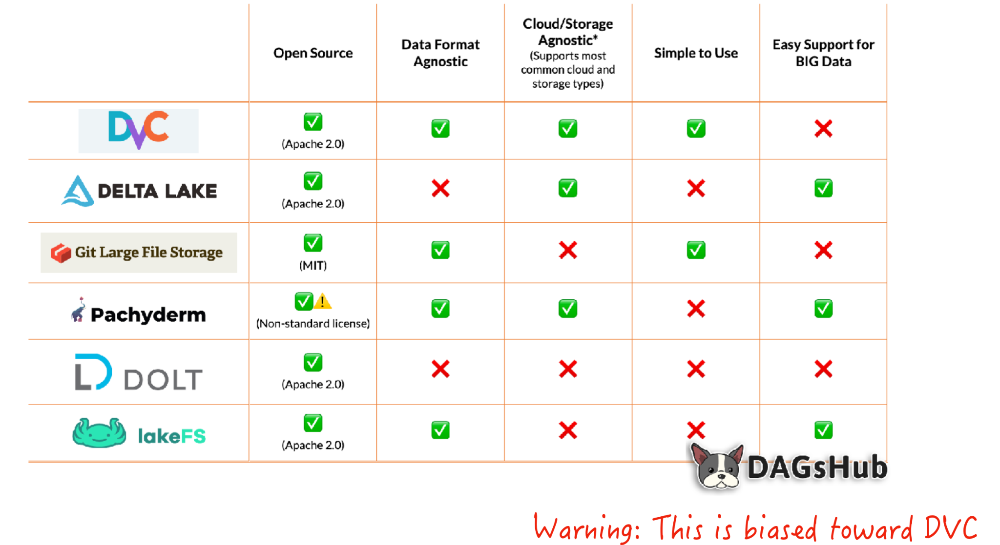

[DVC](https://dvc.org/) is a great tool for this. DVC
helps upload your data asset to a remote storage location every time you
commit changes to the data file or trigger a commit; it functions like a
fancier git-lfs. It adds features like lineage for data and model
artifacts, allowing you to recreate pipelines.

Several techniques are associated with privacy-controlled data, like
[federated
learning](https://blog.ml.cmu.edu/2019/11/12/federated-learning-challenges-methods-and-future-directions/),
differential privacy, and learning on encrypted data. These techniques
are still in research, so they aren't quite ready for an FSDL
recommendation.
