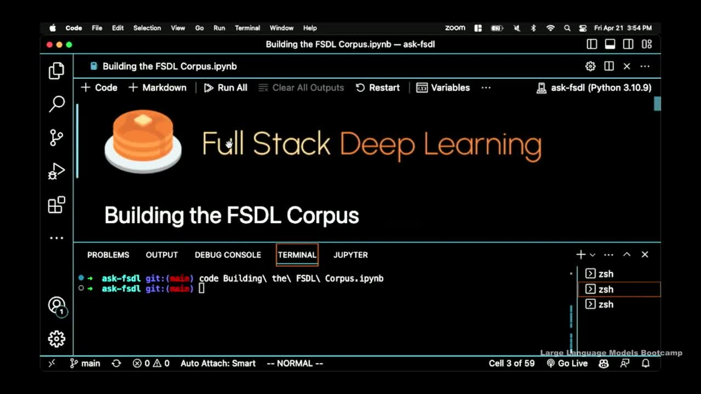
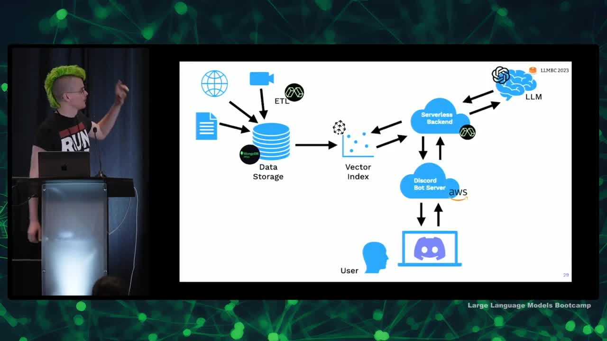
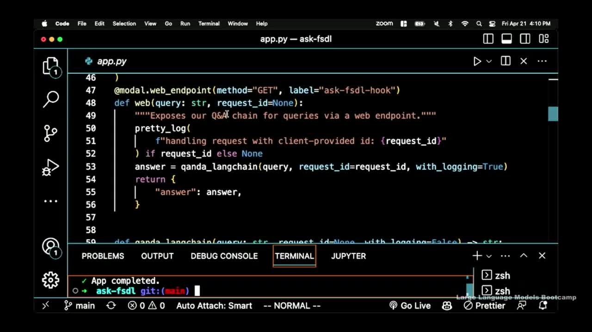
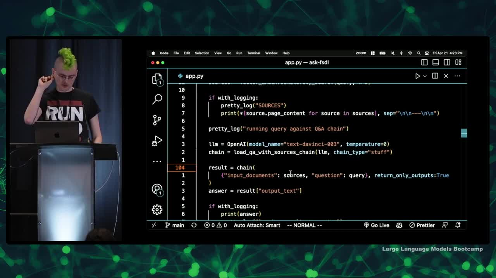

## Chapter Summaries

### SWE Tooling: make, precommit, etc

- Walked everyone through the code base for the Discord bot they interacted with
- Sourced question-answering over a corpus of information using Vector storage for retrieval
- GitHub repo available for this project, but may not be able to execute the code without accounts on all services
- Makefile created for easier project management, setting up environment and authentication, and running setup commands
- Incorporated software tools like pre-commit checks, black for Python auto-formatting, and rust-powered formatter
- Shell check tool useful for catching issues in bash scripts

### Data Cleaning

- Initial approach of scraping data and chunking into smaller pieces did not yield good results
- Improved results by spending time understanding the data and preserving the structure during processing
- Extracting textual information from other sources like images and YouTube videos can enhance the usefulness of language models
- Sometimes simple solutions to specific data sources and problems can greatly improve the quality of results
- The unglamorous work of getting to know the data and writing code to manage it properly can result in big dividends for language model applications

### Infrastructure: Modal

- Discussed the ETL component of extracting, transforming, and loading data from various sources
- Discussed using Python packages for data transformation and addressing dependency issues with tools like pre-commit
- Explained the benefits of the modal component in creating lightweight virtual containers for different tasks
- Modal containers are fast and efficient, aiding in quick development cycles and allowing for containerization without the pains of traditional Docker images
- Modal also allows for the creation of serverless applications with auto-scaling and resource management
- Debugging and local development can be done through the interactive mode by connecting to a container running on modal
- showModal provides an interface for tracking application activity, utilization, and resource allocation, making it a versatile tool for various projects

### Frontend: Gradio & Discord

- Introduced radio user interface, allowing users to create interfaces in pure Python
- Radio UI is flexible, supported by Hugging Face, and rapidly adopting machine learning features
- Examples of radio UI use include Alpaca, Flamingo, and Dolly mini
- Radio UI is easy to set up, portable, flexible, and comes with an API with OpenAPI spec
- Discord bot integrated with Python library Discord.py; alternative library Interactions.py is also available
- Radio UI is built on FastAPI for asynchronous Python web service
- Application mainly runs on the model's infrastructure in containers, serving traffic as needed

### Embeddings & ETL

- Used OpenAI's ada002 model to generate embeddings, which are much cheaper than generation endpoints
- Currently using a vector index for data storage, but considering adding additional types of search
- Discussed processing PDFs in a previous lecture, mentioned using local code to extract URLs and using a map function with controlled concurrency
- Retrieval results are put into the zero-shot problem using an F-string template in LangChain's prompt template
- Compared LangChain to Hugging Face Transformers Library as a framework and mentioned that their code is often simple, but valuable for its interface and compatibility with other tools

### Monitoring & Improvement: Gantry

- Top three challenges in bringing the spot to the next level: improving retrieval, improving the quality of model outputs, and identifying a solid user base.
- Using tools like Datadog, Sentry, Honeycomb, and Gantry for handling web services, logging, and monitoring model behavior.
- The same principle of tracing and monitoring applies to both ML-powered apps and LLM-powered apps.
- Gantry provides a useful service for tracking and enriching logged data, including toxicity checks and other natural language-based or numerical analyses.
- Using language models to check on the performance and outputs of other language models.
- Contributing to the development of the tool as a teaching and learning application is open and encouraged.

