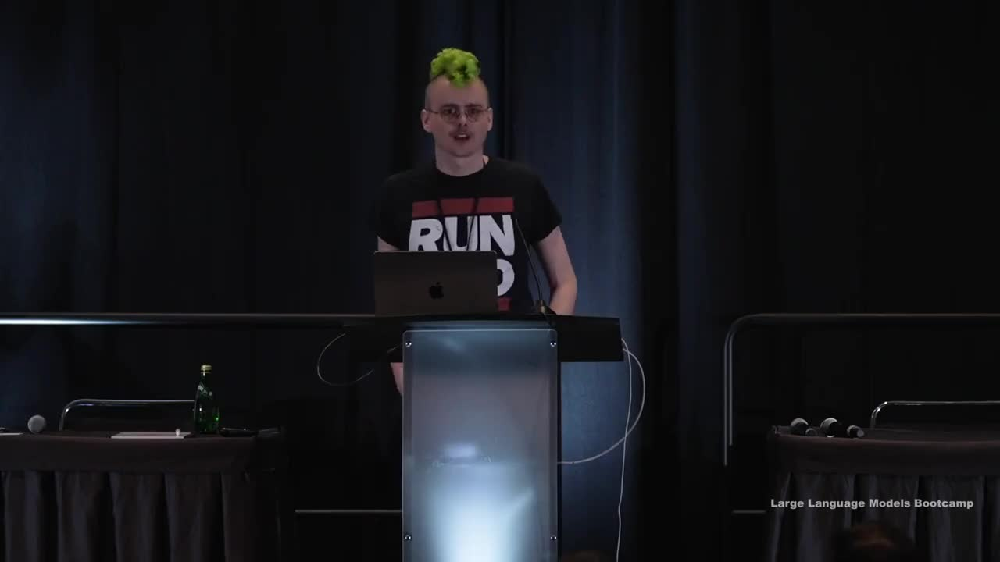
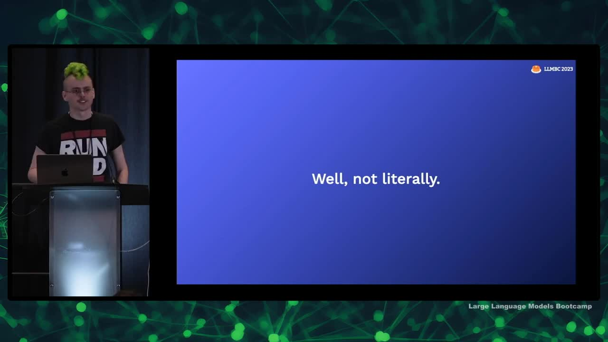
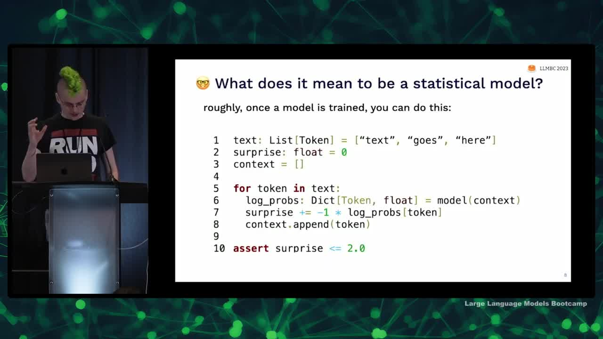
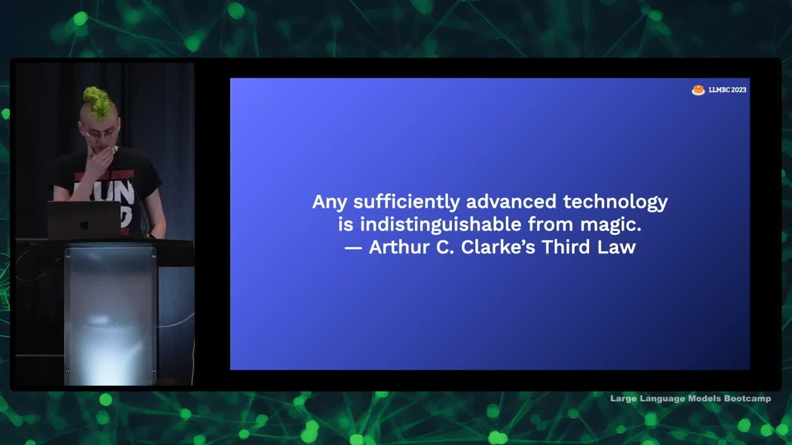
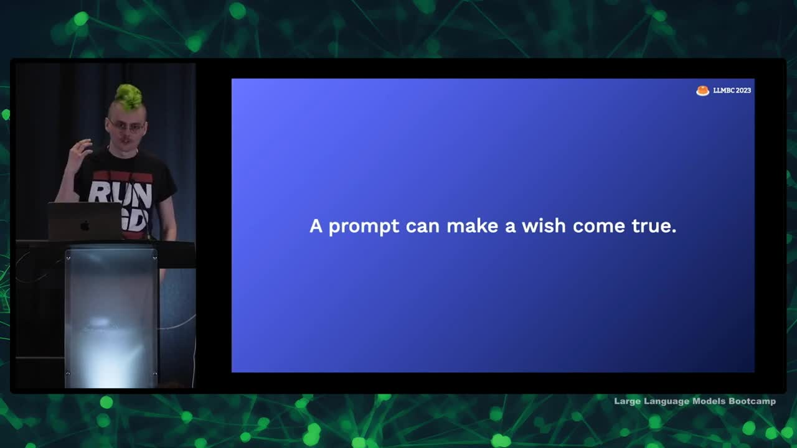
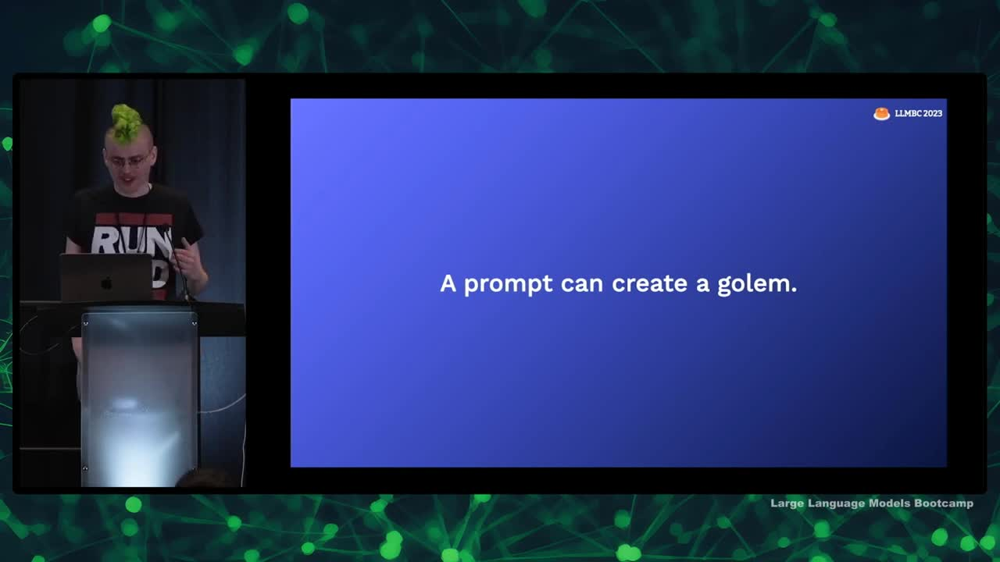
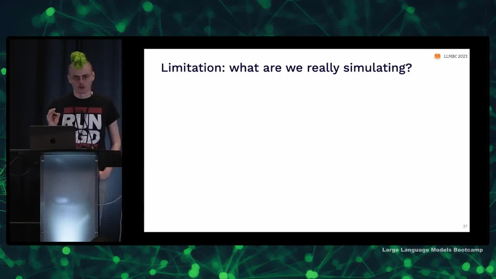
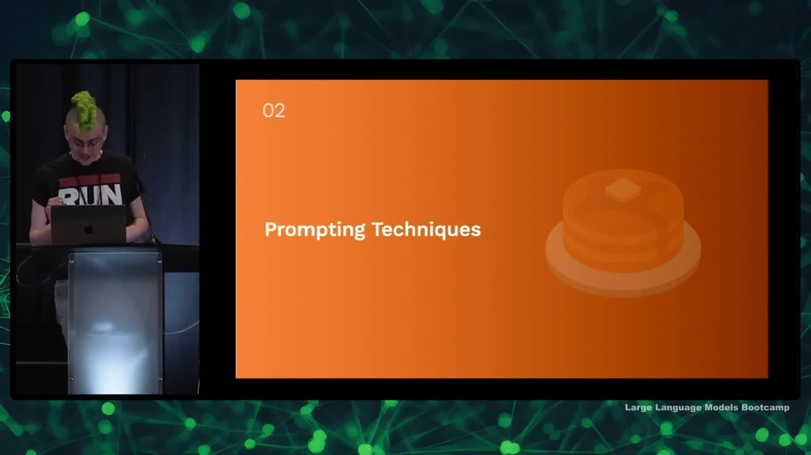
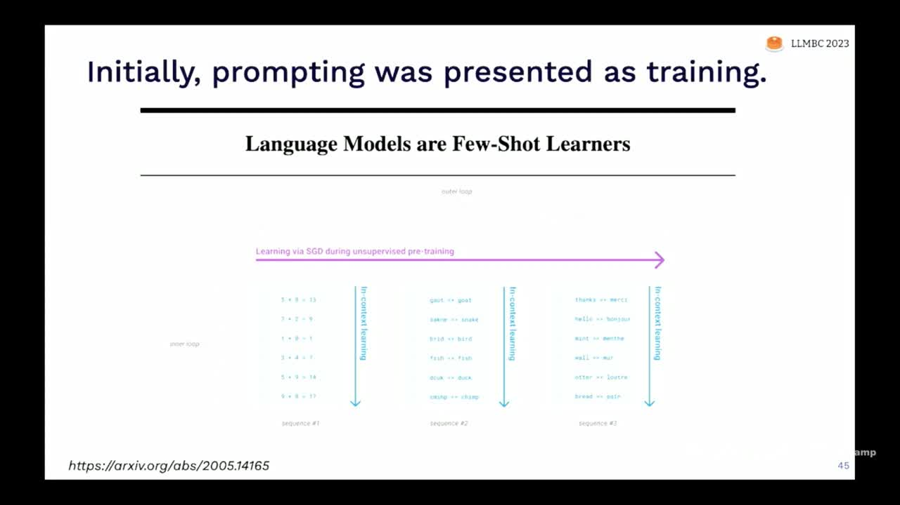
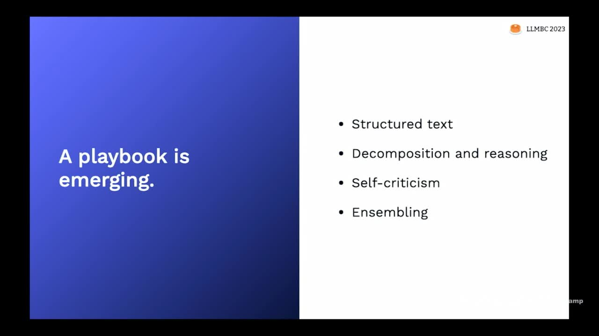

## Chapter Summaries

### Intro

- The lecture covers technical skills needed to train language models to do desired tasks
- The lecture specifically focuses on prompt engineering, which involves designing text to put into language models
- Prompt engineering replaces some approaches used in constructing machine learning models in the past
- There are two components to the talk: high-level intuitions for prompter and an emerging playbook for effective prompting techniques.

### Language models are statistical models of text

- Language models are not literal magic spells or have physical brains
- They are statistical models of text, similar to a statistical model of data with a bell curve
- They use linear algebra and are trained to give probabilities of what the next word in a text will be, using auto regressive modeling
- With sufficient training on a large amount of text, the language model will assign a high probability to most text samples.

### But "statistical model" gives bad intuition

- Language models learn patterns in text through statistical modeling
- Intuition drawn from experience with other statistical models (linear regression, gaussian distributions) and models of text (Google's autocomplete)
- Language models are more complex than traditional statistical models
- Bing chat can process SVG files as text and describe the content, demonstrating the capabilities of language models
- Probabilistic programming offers a better intuition for complex statistical models, which are essentially programs that operate on random data
- A Python program is shown as an example of a probabilistic program that generates answers based on a question and brainstormed thoughts
- Probabilistic programs can be represented by graphical models
- Language model Cascades by Dohan et al. explores how prompting tricks and other techniques can be explained in terms of probabilistic programs

### Prompts are magic spells

- The speaker draws inspiration from Arthur C Clarke's laws of Technology
- Advanced technology can seem like magic
- Prompts are like magic spells, collections of words used to achieve impossible effects
- Spending too much time learning prompts can negatively impact mental health
- Three intuitions for prompts:
  - For pre-trained models, a prompt is a portal to an alternate universe
  - For instruction-tuned models, a prompt is a wish
  - For agent simulation, a prompt creates a Golem.

### Prompts are portals to alternate universes

- Prompt can create a portal to an alternate universe.
- Documents are like different little universes.
- Language model is a probabilistic model of text that assigns a weight/probability to all possible documents.
- Prompting re-weights the documents and focuses on a particular universe/document.
- The process of prompting is subtractive, and it narrows down the mass of predictions to focus on a particular world.
- The process involves sculpting and taking out from the set of all possible universes and picking out the one that we want.
- We are not capable of jumping to an alternate universe and pulling information from it.
- Prompting can work like running Google on nearby universes.
- There are lots of ideas that we have in documents in our world that haven't yet been combined but could easily be combined.

### A prompt can make a wish come true

- Language models are probabilistic models of text that shape and sculpt from a set of all possible documents to a set of possible universes.
- Instruction tuned models, such as chat GPT or the command models of cohere or Claude from anthropic, can grant your wishes like Genies by just asking and getting it.
- Anthropics paper shows the concern about the capacity for moral self-correction of large models by making them less biased.
- They suggest making an unbiased answer by using unbiased prompts instead of biased ones, using simple low-level patterns of text, and turning negation statements into assertions.
- Instruction fine-tune models are trained to mimic annotators of data, and to get good performance, they should be treated like newly hired contractors without much domain expertise.

### A prompt can create a golem

- Prompting magic can be used to create Golems and magical artificial agents
- Golems are creatures from Jewish folklore that can be commanded to perform tasks
- Models can take on personas and improved their performance on tasks
- Language models are primarily concerned with modeling text, but to get better at it they need to model internal processes that produce text
- Language models need to simulate agent models to produce utterances with communicative intentions
- Carefully choosing prompt components can make the model simulate an agent simulator, which is the primary thing used to predict the next token
- There are limitations to this approach.

### Limitations of LLMs as simulators

- The limitations of current Universal simulators and Golem Builders are discussed in the lecture excerpt.
- Simulation is mostly based on text written by humans and does not include simulations of all data in the world or the state of the Universe.
- Simulating super intelligent AI is difficult as there are no such data sets available for learning to simulate.
- Fictional super intelligences can be simulated, but the result may not be accurate.
- Language models are good at simulating human reactions on social media for a few seconds, but not for minutes or hours.
- Most data sets come from books, and common fictional personas can be simulated well.
- Language models can guess the output of simple programs, but cannot perfectly simulate a programming language like Python.
- Simulating live data from the real world is not possible with language models.
- The weakest simulators of language models should be replaced with the real deal whenever possible.
- Pre-trained models are mostly alternate universe document generators.
- Instruction models will answer your wishes but be careful what you ask for.
- Language models can be agent simulators, but their quality varies depending on the model and agent.

### Prompting techniques are mostly tricks

- This section covers prompt engineering tricks for language models
- Many of these tricks can be explained in just a few sentences, but there is a lot of marketing fluff in research papers
- The core language modeling has more depth than the fiddly bits of prompt engineering
- The lecture will cover some common misconceptions and bad ideas about prompt engineering, such as few-shot learning not being effective and tokenization causing problems
- The lecture will also provide some tips and tricks for dealing with tokenization.

### Few-shot learning isn't the right model for prompting

- Language models were initially unclear in terms of usefulness but the GPT-3 paper argues that they can serve as few shot learners through context and prompts.
- However, models struggle to move away from their pre-training and may ignore labels provided in tasks.
- The ability to permute labels and still get similar results requires a large amount of examples.
- Treating the prompt as a way to achieve few shot learning is not always effective.

### Character-level operations are hard

- Language models see characters as tokens, which makes character-level operations difficult.
- Adding spaces between letters can change the tokenization and help with character-level issues.
- GPT-4 can handle character-level tasks better than previous models.
- It's better to use traditional programming for string manipulation than relying on the language model.

### The prompting playbook: reasoning, reflection, & ensembling

- Language models are good at predicting formatted text, making it easier to generate code and pseudo-code
- Using triple backticks can put the model in the universe of computer programs
- Decomposing a task into smaller pieces can help language models generate more accurate outputs
- Chain of Thought prompting can elicit reasoning from the model by putting it in the type of document with explanations before answers
- Ensembling the results of multiple models can increase the quality of the output
- Combining different techniques, such as few-shot examples, Chain of Thought prompting, and ensembling, can match average human performance on difficult benchmarks
- Different prompt engineering techniques have different impacts on latency and compute costs, so they should be used appropriately.